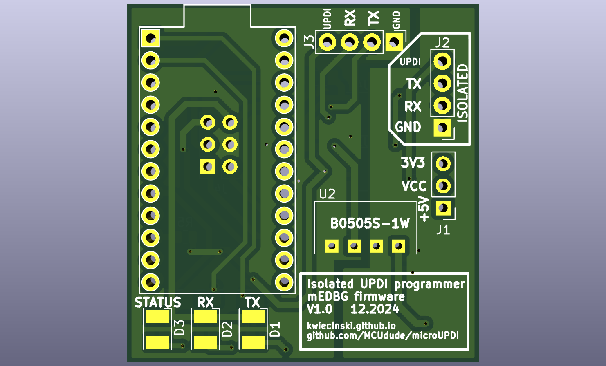
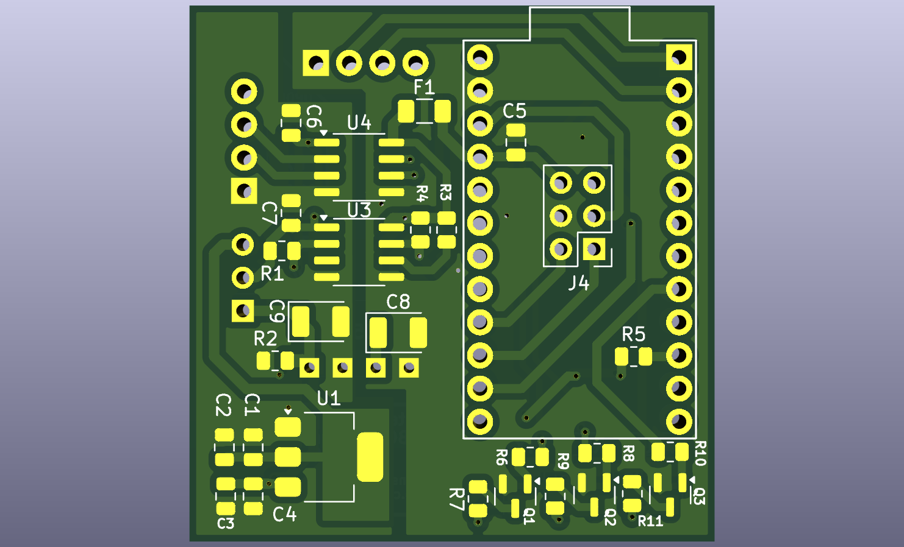

# microUPDI\_iso

DIY UPDI programmer with additional data line isolators, allowing you to safely work on high-voltage (HV) projects.

This project is based on the original [microUPDI project by MCUdude](https://github.com/MCUdude/microUPDI),\
and the firmware is sourced from [microUPDIcore](https://github.com/MCUdude/microUPDIcore).

<div style="display: flex; justify-content: space-around; align-items: center;">
    
    
</div>

---

### IMPORTANT

You might find references stating that the mEDBG programmer supports the AVR-Dx series of microcontrollers:\
[Microchip Device Support Documentation](https://packs.download.microchip.com/DeviceDoc/Device_Support.pdf).

However, **this is not true!** The microUPDI programmer does not support the AVR-Dx series. It is compatible only with the megaAVR-0 and tinyAVR-0/1/2 series. All device and firmware updates are available from the Microchip Packs website, but the mEDBG has not seen significant updates in years.

---

### Hardware

The microUPDI programmer is built on the **Pro Micro 5V/16MHz** board, which uses the ATmega32U4 microcontroller. I purchased it cheaply from China, and it works just fine.

To isolate the data and power lines, you need the following components:

- **ADuM1250**: A bidirectional digital data isolator for the UPDI interface.
- **ADuM1281**: A dual-channel isolator for UART RX and TX lines.

For UART, any isolator capable of handling these lines will suffice; it doesn’t have to be the ADuM1281 specifically. However, for UPDI, the isolator must support bidirectional communication. I tested the ADuM1250 (designed for I²C), and it works correctly in this context.

---

### Software

#### Flashing the Firmware

The original method suggested by MCUdude involves using the Arduino IDE to upload `.hex` and `.eep` files to the Pro Micro board using the bootloader. Unfortunately, I encountered compilation issues with this approach.

Instead, I used **avrdude** to program the board. Ensure you are using the latest version of avrdude.

---

#### Checking the Bootloader

Before proceeding, identify the bootloader type on your Pro Micro board.\
To program the board using the bootloader, you need to reset the Pro Micro. After resetting, a new COM port will appear:

- For example, the board might normally use `COM11`, but after a reset, you’ll see `COM12` for the bootloader.

To extend the bootloader activation time, use the **double-reset** method. Quickly reset the board twice, and you’ll have 8 seconds (instead of the default 3 seconds) to upload the firmware.\
[Learn more about the Pro Micro bootloader here](https://learn.sparkfun.com/tutorials/pro-micro--fio-v3-hookup-guide/troubleshooting-and-faq).

---

#### Using avrdude

Run the following command to verify communication with the board:

```bash
avrdude.exe -C avrdude.conf -c avr109 -P COM12 -patmega32u4 -v
```

Explanation of the parameters:

- `-v`: Enables verbose mode for detailed output.
- `-c avr109`: Specifies the bootloader protocol (Caterina in this case).
- `-P COM12`: Selects the bootloader COM port.

If communication is successful, you’ll see details about the device signature and bootloader. If you encounter a “not in sync” error, your bootloader might differ or require alternative settings.

For me, the bootloader type was `avr109`.

For more options, consult the [avrdude documentation](https://avrdudes.github.io/avrdude/7.3/avrdude_4.html).

---

#### Using the Load\_firmware.bat Script

You can use a slightly modified version of MCUdude’s script to load the firmware.

Update the script with the paths to `avrdude.exe` and `avrdude.conf`:

```bat
SET AVRDUDE_PATH=avrdude.exe
SET AVRDUDE_CONF_PATH=avrdude.conf
```

Set the programmer type based on your bootloader:

```bat
SET PROGRAMMER=avr109
```

Specify the COM port that appears after resetting the board:

```bat
SET EXTRA_FLAGS=-P COM12 -b57600
```

Target-specific settings:

```bat
SET TARGET=atmega32u4
SET FLASH_FILE=mEDBG_UPDI.hex
SET EEPROM_FILE=mEDBG_UPDI.eep
```

Make sure all files are in the same directory as the `Load_firmware.bat` script.

---

#### Example Output

If everything is configured correctly, you should see output like this:

```plaintext
Programmer Type : butterfly
Description     : Atmel AppNote AVR109 Boot Loader

Connecting to programmer: .
Found programmer: Id = "CATERIN"; type = S
    Software Version = 1.0; No Hardware Version given.
Programmer supports auto addr increment.
Programmer supports buffered memory access with buffersize=128 bytes.

Programmer supports the following devices:
    Device code: 0x44

avrdude.exe: devcode selected: 0x44
avrdude.exe: AVR device initialized and ready to accept instructions

Reading | ################################################## | 100% 0.00s

avrdude.exe: Device signature = 0x1e9587 (probably m32u4)
avrdude.exe: safemode: hfuse reads as D8
avrdude.exe: safemode: efuse reads as CB

avrdude.exe: safemode: Fuses OK (E:CB, H:D8, L:FF)

avrdude.exe done.  Thank you.
```
